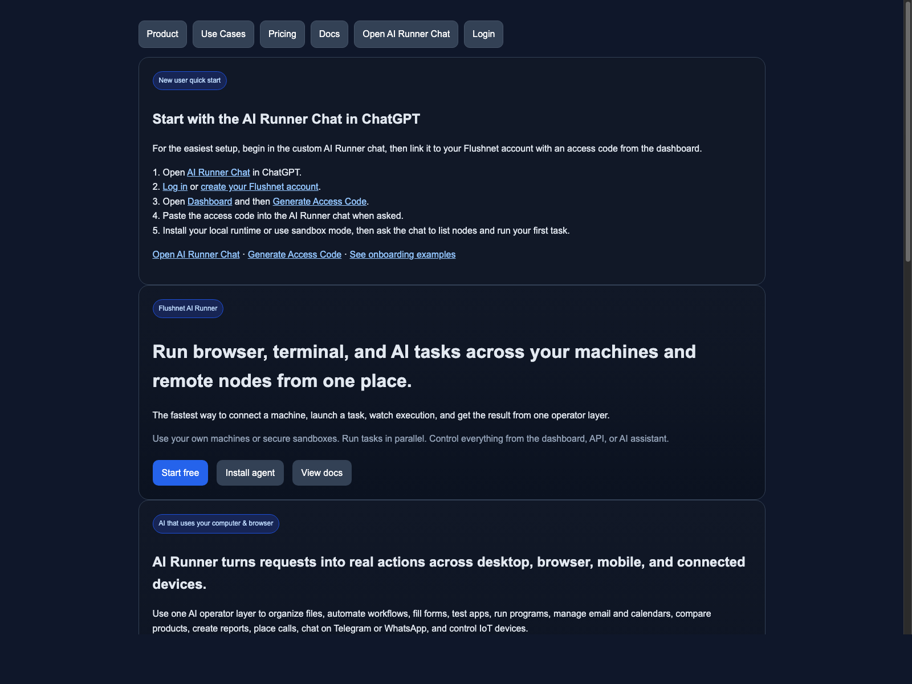

# Flushnet AI Runner

Flushnet AI Runner lets you run browser automation, terminal commands, file operations, and AI workflows across local machines, remote nodes, and sandboxes.

## Get started

- Website: https://www.flushnet.net/api/airunner
- Installers: https://www.flushnet.net/api/installer.php
- Docs: https://www.flushnet.net/api/docs.php
- Dashboard: https://www.flushnet.net/api/dashboard/
- Pricing: https://www.flushnet.net/api/pricing.php
- Support: https://www.flushnet.net/api/support.php

## What it does

- Browser automation
- Terminal execution
- File operations
- AI task execution
- Remote node control
- Multi-node workflows

## Documentation

- [Overview](docs/overview.md)
- [Installation](docs/installation.md)
- [Capabilities](docs/capabilities.md)
- [Links](docs/links.md)

## Support

For documentation, setup, and product help:

- Docs: https://www.flushnet.net/api/docs.php
- Help: https://www.flushnet.net/api/help/
- Support: https://www.flushnet.net/api/support.php
